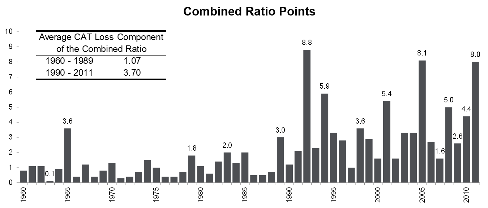
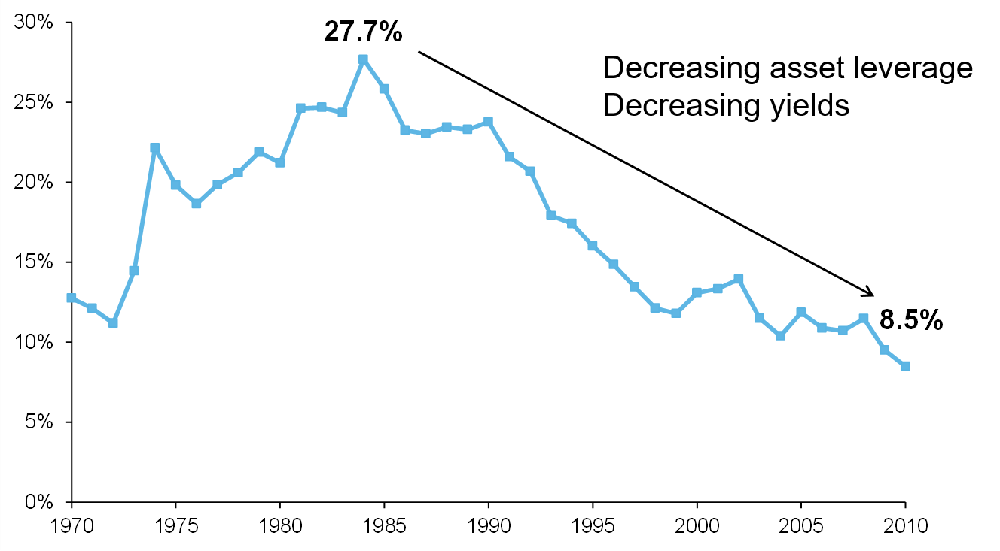
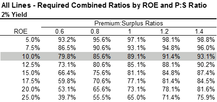

```{r setup, include=FALSE}
options(htmltools.dir.version = FALSE)
options

```

class: inverse, center, middle

# Introduction

---

### US P&C Industry Pre-tax Operating ROEs (1967 – 2011)

```{r pic-1, echo=FALSE, out.width='100%'}
knitr::include_graphics('img/where-is-the-profit-1.png')
```

.footnote[.small[source: AM Best, Aon Benfield Analytics]]

---

### Components of Operating Return on Equity (ROE)

```{r pic-2, echo=FALSE, out.width='100%'}

```

---

### Operating ROEs: Investment vs. Underwriting

```{r pic-3, echo=FALSE, out.width='100%'}

```

.footnote[.small[source: AM Best, Aon Benfield Analytics]]

---

### Value of Consistent and Profitable Underwriting

.center[
```{r pic-4, echo=FALSE, out.width='80%'}

```
]

.footnote[.small[source: SNL Financial, Aon Benfield Analytics]]

---

### Value of Consistent and Profitable Underwriting

.center[
```{r pic-5, echo=FALSE, out.width='80%'}

```
]

.footnote[.small[source: SNL Financial, Aon Benfield Analytics]]

---
class: inverse, center, middle

# Where have we been? – Underwriting

---

### Components of Operating Return on Equity (ROE)

```{r pic-6, echo=FALSE, out.width='100%'}

```

---

### Number of Years with Underwriting Profits by Decade

.right-column[
```{r pic-7, echo=FALSE, out.width='100%'}

```
]

.left-column[

UW Profits common before 1980
- 2 of every 3 years prior to 1980 had combined ratios below 100 

No UW profit recorded for 25 straight years from 1979 to 2003

]

.footnote[.small[
Data for the 2010s includes 2010 and 2011

Note: Date for 1920-1934 based on stock companies only

Sources: Insurance Information Institute research from AM Best Data
]]

---

### Calendar Year Loss Ratios by Year

```{r pic-8, echo=FALSE, out.width='100%'}

```

- Average expense ratio from 1970 – 2010 approximately 28%
- Rule of thumb for the industry - loss ratios below 72% will produce UW profit

.footnote[.small[source: AM Best, Aon Benfield Analytics]]

---

### Combined Ratio Points Associated with Catastrophe Losses

```{r pic-9, echo=FALSE, out.width='100%'}

```

- CAT Loss contribution to combined ratios by year has increased almost four fold since 1990 relative to 1960 to 1989


.footnote[.small[
Notes: Private carrier losses only.  Excludes loss adjustment expenses and reinsurance reinstatement premiums. Figures are adjusted for losses ultimately paid by foreign insurers and reinsurers.

Source: ISO; Insurance Information Institute.

]]

---

### Calendar Year vs. Accident Year Loss Ratios

.center[
```{r pic-10, echo=FALSE, out.width='85%'}

```
]

- Since 1996, reserve development has contributed between -4.3 to +6.4 calendar year loss ratio points
- Currently we are in a period of favorable reserve development
    - Accident year on average 2.5 points worse than calendar year
- How long can favorable reserve development continue to suppress loss ratios?

.footnote[.small[source: SNL Financial, Aon Benfield Analytics]]

---

### Historical Premium Leverage

.center[
```{r pic-11, echo=FALSE, out.width='85%'}

```
]

- Surplus has grown at faster rate than premium since 1975
- In 1975, every combined ratio point of profit generated an ROE of 2.7%
- In 2011, a combined ratio point of profit only generates a 0.7% ROE 

.footnote[.small[source: AM Best, Aon Benfield Analytics]]

---

### Distribution of 2011 Premium Leverage: Stock Company vs. Mutual Company, Commercial vs. Personal

.center[
```{r pic-12, echo=FALSE, out.width='90%'}

```
]

---

### Macro Premium Trends: Premium to GDP Ratio

.center[
```{r pic-13, echo=FALSE, out.width='75%'}

```
]

- NWP to GDP ratio at all time low of 2.9%

- Down from 4.1% high in 1987

.footnote[.small[
Sources:  A.M. Best’s Aggregates and Averages, IMF World Economic Outlook Database (www.imf.org), SNL Financial, Aon Benfield Analytics
]]

---
class: inverse, center, middle

# Where have we been? – Investments

---

### Components of Operating Return on Equity (ROE)

.center[
```{r pic-14, echo=FALSE, out.width='100%'}

```
]

---

### Historical Investment Income Contribution to Pre-Tax ROE

.center[
```{r pic-15, echo=FALSE, out.width='100%'}

```
]

- Current investment and leverage environment contributes 1/3 as much pre-tax ROE as 1984 peak

.footnote[.small[source: AM Best, Aon Benfield Analytics]]

---

### US 10 Year Treasury Note Yields (1970 – 2011)

.center[
```{r pic-16, echo=FALSE, out.width='100%'}

```
]

.footnote[.small[source: US Department of Treasury]]

---

### US Treasury Yield Curves (August 2007 – June 2012)

.center[
```{r pic-17, echo=FALSE, out.width='100%'}

```
]

.footnote[.small[source: US Department of Treasury]]

---

### Historical Asset Leverage

.center[
```{r pic-18, echo=FALSE, out.width='85%'}
knitr::include_graphics('img/where-is-the-profit-18.png')
```
]

- Every 1% return on assets in 1975 generated 4.7% of ROE from Inv Inc 
- In 2011 only generates 2.7% ROE

.footnote[.small[source: AM Best, Aon Benfield Analytics]]

---

### Distribution of 2011 Asset Leverage: Stock Company vs. Mutual Company, Commercial vs. Personal

.center[
```{r pic-19, echo=FALSE, out.width='90%'}

```
]

---

### A Tale of Two Trends: Insured Risk Innovation Deficit

.center[
```{r pic-20, echo=FALSE, out.width='75%'}

```
]

Loss to GDP has instead had 2 distinctive historical trends:
- Increasing trend up to 1987
- Decreasing trend since 1987

P&C insured risk as share of GDP has been shrinking

---

### A 100% Combined Ratio Isn’t What It Once Was…

.center[
```{r pic-21, echo=FALSE, out.width='100%'}

```
]

- At 3:1 asset leverage, a 200 bps drop in yield results in a 600 bps drop in ROE

---
class: inverse, center, middle

# Where are we going?

---

### Components of Operating Return on Equity (ROE)

.center[
```{r pic-22, echo=FALSE, out.width='85%'}

```
]

---

### Target Combined Ratios by ROE and P:S Ratio – All Lines

.center[
```{r pic-23, echo=FALSE, out.width='100%'}

```
]

---

### Target Combined Ratios by Line

.center[
```{r pic-24, echo=FALSE, out.width='100%'}

```
]

---

### Macro Premium Trends: DWP Trends through Q3 2011

.center[
```{r pic-25, echo=FALSE, out.width='100%'}

```
]

- Quarterly personal lines DWP exceeded commercial lines in Q4 2009 for the first time
- Although personal lines annual premium volume continues to be larger than commercial lines, commercial lines premiums continue to grow at a faster rate in Q3 2011
- Audit premiums suppressed commercial lines DWP in 2009, exacerbating 2009 declines and inflating 2010 increases beyond changes based on rate and exposure

---

### Loss Cost Trend Environment

.center[
```{r pic-26, echo=FALSE, out.width='100%'}

```
]

---

### U.S. Reserve Estimated Adequacy at YE 2011 (USD Billions)

.center[
```{r pic-27, echo=FALSE, out.width='100%'}

```
]

P&C Industry undiscounted statutory reserves as of December 31, 2011 estimated to be USD11.7 Billion redundant

USD12.7 Billion reserves released in calendar year 2011

At the current average run rate, the redundancy will be eliminated within 1.1 years

---

### Anticipated Share Repurchase Activity in 2012

.center[
```{r pic-28, echo=FALSE, out.width='80%'}

```
]

---

### Low Interest Rate Environment Through 2013

.center[
```{r pic-29, echo=FALSE, out.width='100%'}

```
]

---

### Effect on Combined Ratio of Lower Investment Yields, by Line

.center[
```{r pic-30, echo=FALSE, out.width='100%'}

```
]

---

### Conclusion

.center[
```{r pic-31, echo=FALSE, out.width='85%'}

```
]

