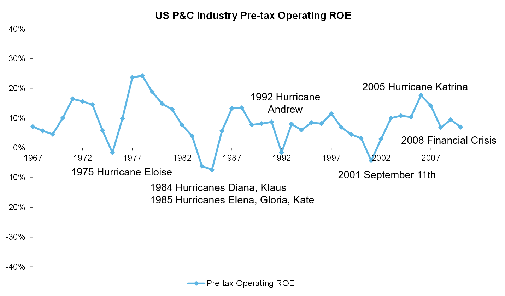

```{r setup, include=FALSE}
options(htmltools.dir.version = FALSE)
options

```

class: inverse, center, middle

# Introduction

---

# US P&C Industry Pre-tax Operating ROEs (1967 – 2011)

```{r op-roes, echo=FALSE, out.width='100%', fig.cap = "source: AM Best, Aon Benfield Analytics"}

```

